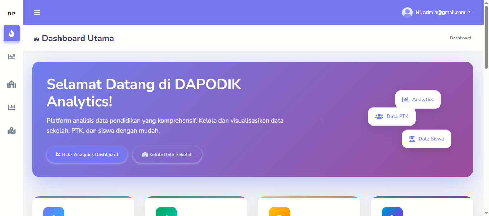

# DapoKalsel - Sistem Informasi Pendidikan Kalimantan Selatan



## 🌟 Tentang Proyek

**DapoKalsel** adalah sebuah sistem informasi komprehensif yang dirancang khusus untuk mengelola dan memvisualisasikan data sekolah di Kalimantan Selatan. Proyek ini merupakan solusi terintegrasi yang terdiri dari dua komponen utama:

1. **Scraper Data Otomatis**: Serangkaian skrip Python yang powerful untuk melakukan web scraping data pendidikan secara otomatis dari sumber resmi. Sistem ini menggunakan **Selenium** untuk navigasi web dinamis dan **Requests/BeautifulSoup** untuk ekstraksi data yang efisien.

2. **Dashboard Web Interaktif**: Aplikasi web berbasis PHP yang modern dan responsif untuk menampilkan, menganalisis, dan mengelola data pendidikan yang telah dikumpulkan. Dilengkapi dengan visualisasi data real-time, peta geografis interaktif, dan sistem manajemen data yang komprehensif.

Proyek ini bertujuan untuk menyediakan platform terpusat bagi Dinas Pendidikan Kalimantan Selatan atau lembaga pendidikan terkait untuk memantau, menganalisis, dan mengelola data sekolah di seluruh wilayah Kalimantan Selatan dengan mudah, efisien, dan akurat.

---

## ✨ Fitur Unggulan

### 🎯 Dashboard & Analitik
* **Dashboard Real-time**: Visualisasi data statistik pendidikan dalam bentuk grafik interaktif
* **Analisis Geografis**: Peta persebaran sekolah dengan clustering berdasarkan wilayah
* **Laporan Komprehensif**: Generate laporan PDF dan Excel untuk berbagai kebutuhan
* **Monitoring Sistem**: Track status scraping dan performa sistem secara real-time

### 🤖 Sistem Scraping Bertingkat
* **Import URL Hierarkis**: Kumpulkan URL sekolah dari tingkat provinsi → kabupaten → kecamatan → sekolah
* **Scraping Massal**: Download data profil sekolah secara batch dengan multi-threading
* **Anti-Detection**: Menggunakan `undetected-chromedriver` untuk menghindari pemblokiran
* **Error Handling**: Sistem retry otomatis dan logging error yang detail

### 📊 Manajemen Data
* **CRUD Lengkap**: Operasi Create, Read, Update, Delete untuk semua entitas data
* **Import/Export**: Kelola data melalui file Excel dan CSV
* **Validasi Data**: Sistem validasi otomatis untuk memastikan integritas data
* **Backup & Restore**: Fitur backup database dan restore data

### 🗺️ Visualisasi Geografis
* **Peta Interaktif**: Tampilan lokasi sekolah menggunakan Leaflet.js
* **Filter Wilayah**: Filter data berdasarkan provinsi, kabupaten, atau kecamatan
* **Clustering**: Pengelompokan sekolah berdasarkan lokasi geografis
* **Layer Management**: Multiple layers untuk berbagai jenis data

### 🔐 Keamanan & Akses
* **Sistem Login**: Autentikasi pengguna dengan session management
* **Role-based Access**: Pembatasan akses berdasarkan peran pengguna
* **Activity Logging**: Pencatatan semua aktivitas pengguna
* **Data Encryption**: Enkripsi data sensitif

---

## 💻 Teknologi yang Digunakan

### Backend Technologies
* **PHP 7.4+**: Server-side scripting untuk aplikasi web
* **Python 3.8+**: Automation dan data processing
* **MySQL/MariaDB**: Database management system

### Frontend Technologies
* **HTML5 & CSS3**: Struktur dan styling modern
* **JavaScript (ES6+)**: Interactive frontend functionality
* **Bootstrap 5**: Responsive UI framework
* **jQuery 3.x**: DOM manipulation dan AJAX

### Python Libraries
* **requests>=2.25.1**: HTTP library untuk web scraping
* **beautifulsoup4>=4.9.3**: HTML parsing dan data extraction
* **pandas>=1.3.0**: Data manipulation dan analysis
* **numpy>=1.21.0**: Numerical computing
* **selenium>=4.0.0**: Web browser automation
* **undetected-chromedriver>=3.4.0**: Anti-detection Chrome driver
* **mysql-connector-python>=8.0.25**: MySQL database connectivity
* **openpyxl>=3.0.7**: Excel file processing

### JavaScript Libraries
* **Chart.js**: Data visualization dan charting
* **Leaflet.js**: Interactive mapping
* **DataTables.js**: Advanced table functionality
* **SweetAlert2**: Beautiful alert dialogs

---

## 🚀 Panduan Instalasi Lengkap

### Prasyarat Sistem

Pastikan sistem Anda memiliki spesifikasi minimum berikut:

**Hardware Requirements:**
* RAM: Minimum 4GB (Recommended 8GB+)
* Storage: 5GB free space
* CPU: Dual-core processor atau lebih baik

**Software Requirements:**
* **XAMPP 7.4+**: Web server dan database - [Download XAMPP](https://www.apachefriends.org)
* **Python 3.8+**: Programming language - [Download Python](https://www.python.org/downloads/)
* **Google Chrome**: Browser untuk Selenium - [Download Chrome](https://www.google.com/chrome/)
* **Git**: Version control - [Download Git](https://git-scm.com/downloads)
* **Code Editor**: VS Code atau editor pilihan Anda

---

### 1. Setup Lingkungan Web (PHP & MySQL)

#### Step 1.1: Clone Repository
```bash
# Navigate to XAMPP htdocs directory
cd C:/xampp/htdocs/

# Clone the repository
git clone [YOUR_REPOSITORY_URL] dapokalsel

# Navigate to project directory
cd dapokalsel
```

#### Step 1.2: Database Setup
1. **Start XAMPP Services**
   - Buka XAMPP Control Panel
   - Start **Apache** dan **MySQL** services

2. **Create Database**
   - Akses http://localhost/phpmyadmin
   - Klik **New** untuk membuat database baru
   - Nama database: `dapodik`
   - Collation: `utf8mb4_unicode_ci`
   - Klik **Create**

3. **Import Database Schema**
   - Pilih database `dapodik`
   - Klik tab **Import**
   - Choose file: `data/db/dapodik.sql`
   - Klik **Go** untuk import

#### Step 1.3: Konfigurasi Database Connection
```php
// File: helper/connection.php
<?php
$servername = "localhost";
$username = "root";
$password = ""; // Sesuaikan dengan setup MySQL Anda
$dbname = "dapodik";

// Test koneksi
$conn = new mysqli($servername, $username, $password, $dbname);
if ($conn->connect_error) {
    die("Connection failed: " . $conn->connect_error);
}
?>
```

#### Step 1.4: Test Aplikasi Web
- Akses: http://localhost/dapokalsel/
- **Default Login Credentials:**
  - Username: `admin`
  - Password: `123456`

---

### 2. Setup Python Scraping Environment

#### Step 2.1: Virtual Environment Setup
```bash
# Navigate to project root
cd C:/xampp/htdocs/dapokalsel

# Create virtual environment
python -m venv venv

# Activate virtual environment
# Windows:
.\venv\Scripts\activate
# Linux/Mac:
source venv/bin/activate
```

#### Step 2.2: Install Python Dependencies (ONE COMMAND!)
```bash
# Upgrade pip first
python -m pip install --upgrade pip

# ✅ INSTALL ALL REQUIRED PACKAGES WITH ONE COMMAND:
pip install -r requirements.txt

# 🧪 Test installation
python -c "import requests, bs4, selenium, pandas, mysql.connector, openpyxl; print('✅ ALL LIBRARIES READY!')"
```

#### Step 2.3: Konfigurasi Database untuk Python
```python
# File: helper/db_connector.py
import mysql.connector
from mysql.connector import Error

def get_db_connection():
    try:
        connection = mysql.connector.connect(
            host='localhost',
            database='dapodik',  # Updated database name
            user='root',
            password=''  # Sesuaikan dengan password MySQL Anda
        )
        return connection
    except Error as e:
        print(f"Error connecting to MySQL: {e}")
        return None
```

---

## 📖 Panduan Penggunaan Sistem

### 🔐 Login dan Dashboard
1. **Login ke Sistem**
   - Akses http://localhost/dapokalsel/
   - Masukkan credentials admin
   - Anda akan diarahkan ke dashboard utama

2. **Navigasi Dashboard**
   - **Overview**: Statistik umum dan grafik trending
   - **Maps**: Visualisasi geografis sekolah
   - **Reports**: Generate laporan custom

### 🌐 Import URL Sekolah (Opsional)

Jika database masih kosong, jalankan skrip import URL:

```bash
# Activate virtual environment
.\venv\Scripts\activate

# Import URL secara bertahap
python sekolah/import_url_main.pyw --url_induk_id=1 --process_type=all

# Atau import per tahap:
python sekolah/import_url_kabupaten.pyw --url_induk_id=1
python sekolah/import_url_kecamatan.pyw --url_induk_id=1
python sekolah/import_url_sekolah.pyw --url_induk_id=1
python transfer_to_scraping_urls.pyw --url_induk_id=1
```

### 🤖 Scraping Data Profil Sekolah

#### Via Web Interface (Recommended):
1. **Pilih URL untuk Scraping**
   - Menu: **Sekolah** > **Kelola URL & Scraping**
   - Pilih URL sekolah yang ingin di-scrape
   - Klik **"Start Scraping"**

2. **Monitor Progress**
   - System akan menjalankan `main_scraper.pyw` di background
   - Monitor progress via web interface
   - Lihat log real-time di dashboard

#### Via Command Line:
```bash
# Scraping dengan log ID tertentu
python main_scraper.pyw --log_id=123

# Contoh workflow lengkap:
# 1. Buat log entry via web interface atau database
# 2. Jalankan scraper dengan log_id yang sesuai
```

### 📊 Analisis dan Visualisasi Data

1. **Dashboard Analytics**
   - Grafik distribusi sekolah per jenjang
   - Statistik siswa dan guru
   - Trend data dari waktu ke waktu

2. **Geographic Analysis**
   - Peta persebaran sekolah
   - Clustering berdasarkan kepadatan
   - Filter multi-level (Provinsi > Kabupaten > Kecamatan)

3. **Data Management**
   - CRUD operations untuk semua entitas
   - Export data ke Excel/CSV
   - Import data dari file external

---

## 🏗️ Struktur Proyek

```
dapokalsel/
├── 📁 assets/                 # Static assets (CSS, JS, images)
│   ├── css/
│   ├── js/
│   └── images/
├── 📁 data/                   		# Data files
│   ├── db/                    		# Database exports
│   └── demo/                  		# Demo screenshots
├── 📁 downloads/              		# Downloaded files from scraping
├── 📁 helper/                 		# Helper classes and configurations
│   ├── connection.php         		# Database connection
│   ├── db_connector.py       		# Python DB connector
│   └── config.ini            		# Configuration file
├── 📁 pages/                  		# Web application pages
├── 📁 sekolah/               		# School-related scripts
│   ├── import_url_kabupaten.pyw
│   ├── import_url_kecamatan.pyw
│   ├── import_url_sekolah.pyw
│   └── import_url_main.pyw
├── 📄 main_scraper.pyw        		# Main scraping script
├── 📄 transfer_to_scraping_urls.pyw
├── 📄 requirements.txt        		# Python dependencies
├── 📄 index.php              		# Web application entry point
└── 📄 README.md              		# This file
```

---

## 🔧 Troubleshooting

### Common Issues & Solutions

#### 1. Python ModuleNotFoundError
```bash
# Pastikan virtual environment aktif
.\venv\Scripts\activate

# Install ulang dependencies dengan ONE COMMAND
pip install -r requirements.txt
```

#### 2. MySQL Connection Error
```php
// Cek konfigurasi di helper/connection.php
// Pastikan MySQL service berjalan di XAMPP
// Pastikan database 'dapodik' sudah dibuat
```

#### 3. Selenium ChromeDriver Issues
```bash
# Pastikan Chrome browser terinstall dan terupdate
# Install ulang undetected-chromedriver
pip uninstall undetected-chromedriver
pip install undetected-chromedriver
```

#### 4. Permission Errors
```bash
# Windows: Jalankan terminal sebagai Administrator
# Linux/Mac: Gunakan sudo jika diperlukan
```

#### 5. Virtual Environment Issues
```bash
# Buat ulang virtual environment jika bermasalah
rmdir /s venv          # Windows
rm -rf venv            # Linux/Mac
python -m venv venv
.\venv\Scripts\activate
pip install -r requirements.txt
```

---

## ⚡ Quick Start Guide

### Untuk Pemula - Instalasi Cepat:

```bash
# 1. Download dan extract project ke C:/xampp/htdocs/dapokalsel

# 2. Start XAMPP (Apache + MySQL)

# 3. Buat database 'dapodik' dan import data/db/dapodik.sql

# 4. Setup Python environment
cd C:/xampp/htdocs/dapokalsel
python -m venv venv
.\venv\Scripts\activate
pip install -r requirements.txt

# 5. Test web application
# Akses: http://localhost/dapokalsel/
# Login: admin / 123456

# 6. Test Python scripts
python -c "import requests, bs4, selenium; print('✅ Ready to scrape!')"
```

**SELESAI!** 🎉 Sistem DapoKalsel siap digunakan!

---

## 📈 Monitoring dan Performance

### System Requirements untuk Production:
- **RAM**: 8GB+ (untuk scraping massal)
- **Storage**: 50GB+ (untuk data dan logs)
- **Network**: Stable internet connection
- **CPU**: Multi-core processor (untuk parallel processing)

### Optimization Tips:
1. **Database Indexing**: Pastikan tabel memiliki index yang proper
2. **Memory Management**: Monitor penggunaan memory saat scraping
3. **Log Rotation**: Implement log rotation untuk mencegah disk penuh
4. **Caching**: Gunakan caching untuk query yang sering diakses

---

## 🤝 Kontribusi

Kami sangat menghargai kontribusi dari komunitas! Berikut cara berkontribusi:

### Cara Berkontribusi:
1. **Fork** repository ini
2. **Create branch** untuk fitur baru: `git checkout -b feature/amazing-feature`
3. **Commit** perubahan: `git commit -m 'Add amazing feature'`
4. **Push** ke branch: `git push origin feature/amazing-feature`
5. **Create Pull Request**

### Development Guidelines:
- Follow PSR-12 untuk kode PHP
- Follow PEP 8 untuk kode Python  
- Tambahkan unit tests untuk fitur baru
- Update dokumentasi jika diperlukan
- Test pada multiple environments

---

## 📝 Changelog

### Version 2.0.0 (Current)
- ✨ Added multi-threaded scraping
- 🔧 Improved error handling and retry mechanisms
- 📊 Enhanced dashboard with new analytics
- 🗺️ Interactive geographic visualization
- 🔐 Better security and authentication

### Version 1.0.0
- 🎉 Initial release
- 📡 Basic web scraping functionality
- 💻 Simple web interface
- 🗄️ Database integration

---

## 📜 Lisensi

Proyek ini dilisensikan under the **MIT License**. Lihat file `LICENSE` untuk detail lengkap.

---

## 🆘 Dukungan

Jika Anda mengalami masalah atau memiliki pertanyaan:

1. **Cek dokumentasi** ini terlebih dahulu
2. **Buat issue** di GitHub repository
3. **Email**: support@dapokalsel.com
4. **Documentation**: Wiki pages di repository

---

## 🙏 Acknowledgments

- **Kemendikdasmen**: Sumber data pendidikan resmi
- **Dinas Pendidikan Kalsel**: Dukungan dan requirements
- **Open Source Community**: Library dan tools yang digunakan
- **Contributors**: Semua yang telah berkontribusi pada proyek ini

---# web-dinas
# web-dinas
# web-dinas
# web-dinas
# web-dinas
